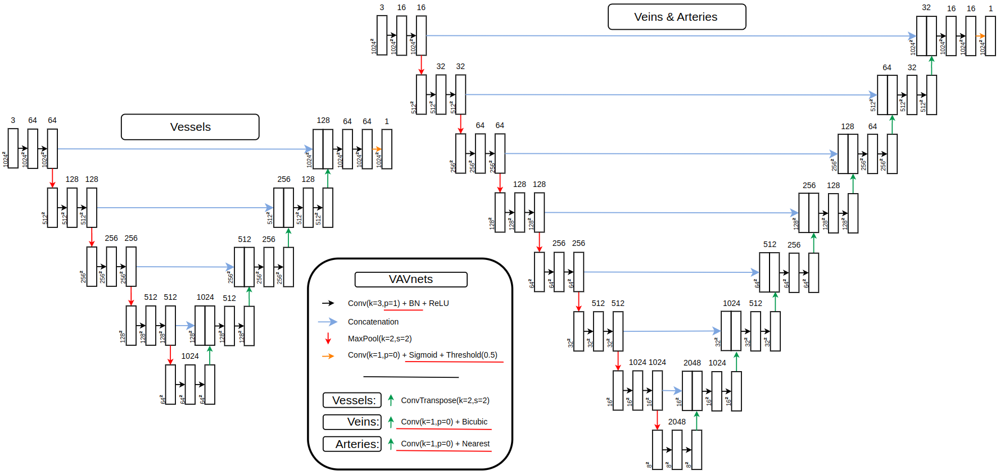
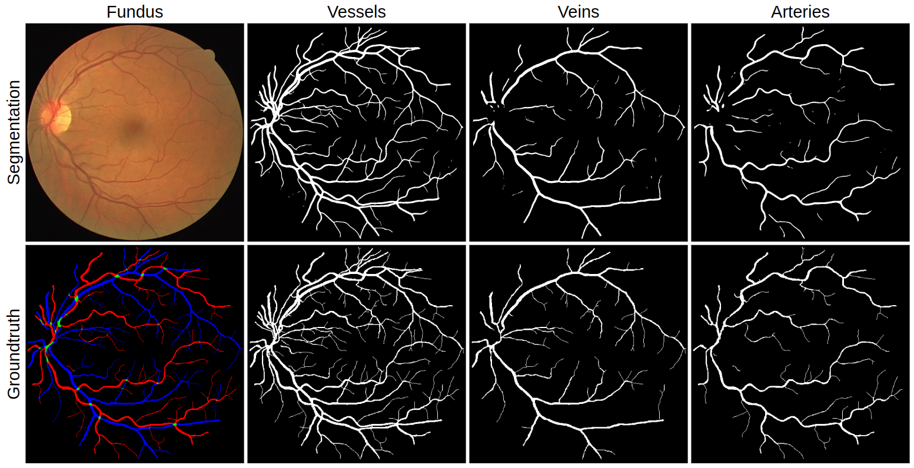

### Supplementary Material for: 
# "VAVnets: retinal vasculature segmentation in few-shot scenarios"

We provide [architecture files](code/) 
(illustrated [here](links/vavnets.png)),
[predicted segmentations](pred/) 
(illustrated [here](links/results.png)), and 
[related statistics](stats/).  

---
As describe in the [article](links/Article.pdf), we found that the use of normalization techniques proves to be most beneficial for our specific tasks.
In particular, batch normalization when added after each convolution layer. However, we utilize it in a non-standard manner during inference.
After training on input training data, we can perform inference on test data using either (Learn) or (Pred).
When using (Learn), the batch normalization layers' expectation and variance are computed over the training data. 
Conversely, when using (Pred), the batch normalization layers' expectation and variance are computed over the testing data. 
Applying (Pred) on the generated weights and biases during inference, as mentioned in \cite{BN}, allows us to recover the original activations by setting $\gamma^{(k)} = \sqrt{\text{Var}[x^{(k)}]}$ and $\beta^{(k)} = \text{E}[x^{(k)}]$. 
It involves no cost, neither in time nor in training resources.
This utilization of normalization is particularly important in domain shift scenarios, considering the performance gap observed between (Pred) and (Learn), as shown in the [article](links/Article.pdf) in Table 2, where (pred) outperform (Learn) at all tasks.

The performance gap is observed at the very first stage of the network development (First results) as well as in the very last stage (Last results). 
The first modification to U-Net is the addition of batch-normalization layers after each convolution. 
The last development step is the use of data augmentation describe afterwards.

Results are reported [here](stats/) with complete details for all databases, <em>bestWay</em> correspond to our use (Pred), while <em>bnTrain</em> correspond to the less-performant use (Learn)

---
### VAVnets architectures

---
### Segmentations compared to groundtruth 

